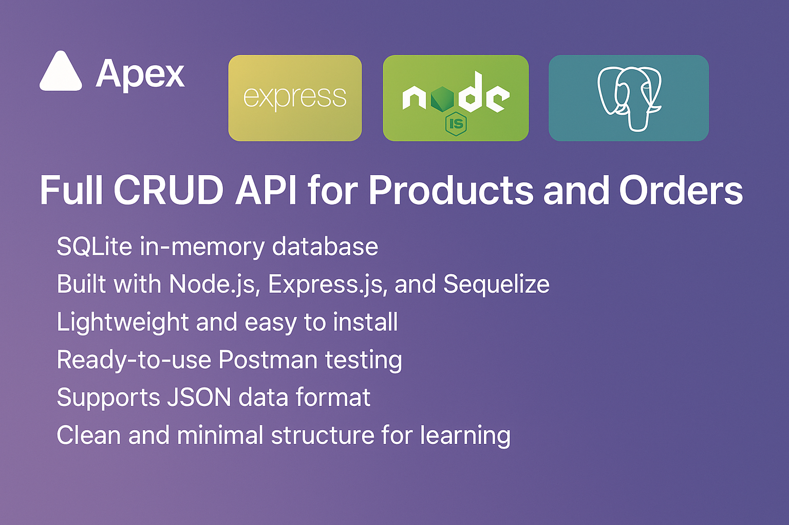
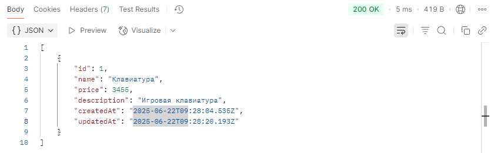
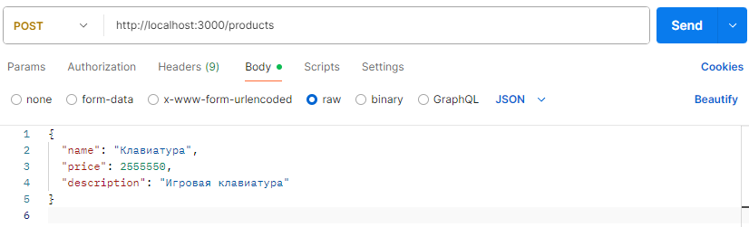
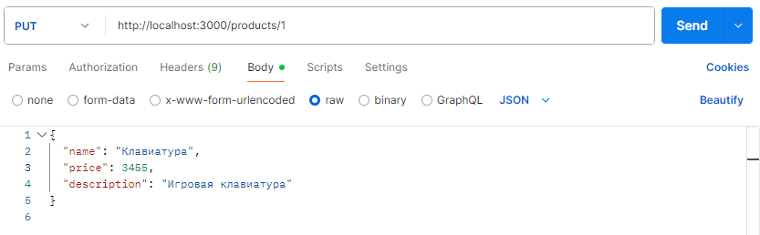
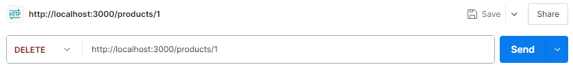
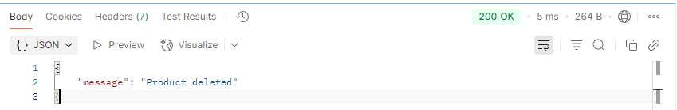

<h1 align="center">
  <br>
  <a href="#"></a>
  <br>
  Apex API
  <br>
</h1>
<h4 align="center">Задание : Программа с использованием Express js , Node js , CRUD api ,Должна быть 1 модель 2 таблицы база данных с 2 энтити .</h4>
<h4 align="center">A CRUD API for managing products and orders using Node.js and Express.</h4>

<p align="center">
  <a href="https://badge.fury.io/js/apex-api">
    
  </a>
  <a href="#">
    
  </a>
  <a href="https://saythanks.io/to/your-email@example.com">
    
  </a>
</p>

<p align="center">
  <a href="#key-features">Возможности</a> •
  <a href="#how-to-use">Как использовать</a> •
  <a href="#Работа-с-API-через-Postman">Postman</a> •
</p>



## Key Features

* Полный CRUD API для продуктов и заказов
* База данных SQLite в оперативной памяти
* Построено с помощью Node.js, Express.js и Sequelize
* Легкий и простой в установке
* Тестирование готового к использованию PostMan
* Поддерживает формат данных JSON
* Простая и минималистичная структура для обучения

---

## How To Use

Для клонирования и использования вам понадобится [Git](https://git-scm.com) и [Node.js](https://nodejs.org/en/download/) установленном на вашем компютере. Из вашей командной строки:

```bash
# Clone this repository
$ git clone https://github.com/futoreqa/valentin.git

# Go into the repository
$ cd EXAM

# Install dependencies
$ npm install

# Run the server
$ npm start

```
---
## Работа с API через Postman

Для тестирования API можно использовать [Postman](https://www.postman.com/).

📦 Примеры запросов

### Получить все продукты
```bash


Метод: GET
URL - http://localhost:3000/products
```



### Вставить продукт
```bash

Метод: POST
URL - http://localhost:3000/products

Raw - Body:
{
  "name": "Клавиатура",
  "price": 1500,
  "description": "Механическая клавиатура"
}
```


### Изменить продукт
```bash

Метод: PUT
URL - http://localhost:3000/products/1

Raw - Body:
{
  "name": "Клавиатура",
  "price": 3455,
  "description": "Механическая клавиатура"
}
```


### Удалить продукт
```bash

Метод: DELETE
URL - http://localhost:3000/products/1

```



---

### Добавить продукт в энтити заказов

```bash

Метод: POST
URL - http://localhost:3000/orders

и тп команды

```

